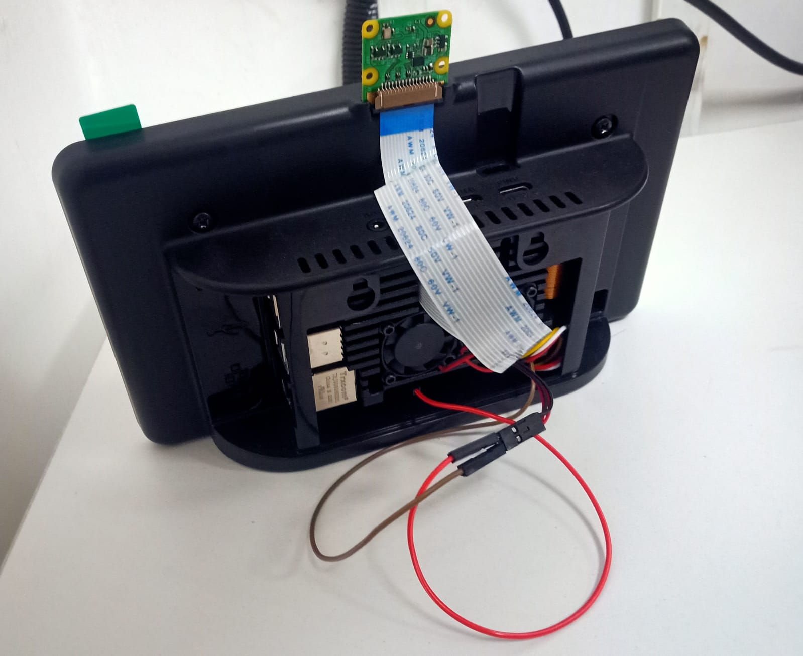
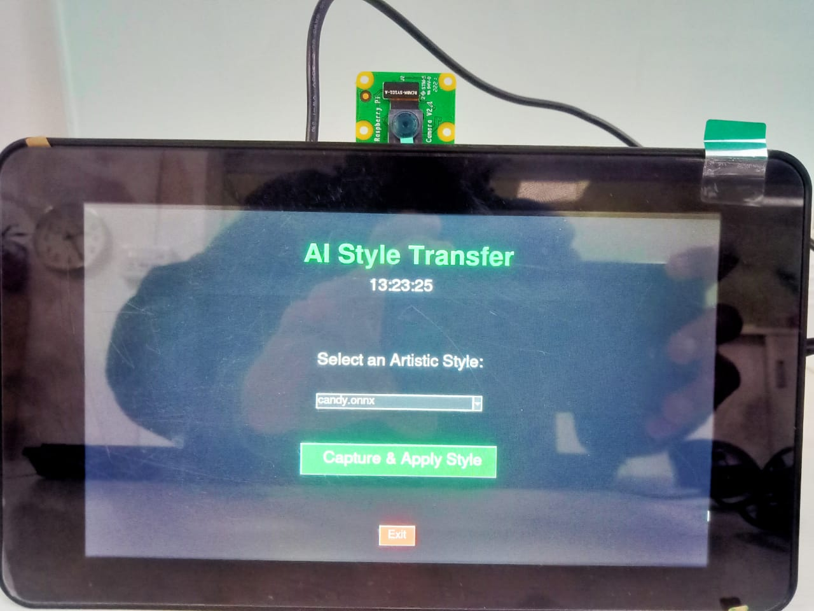
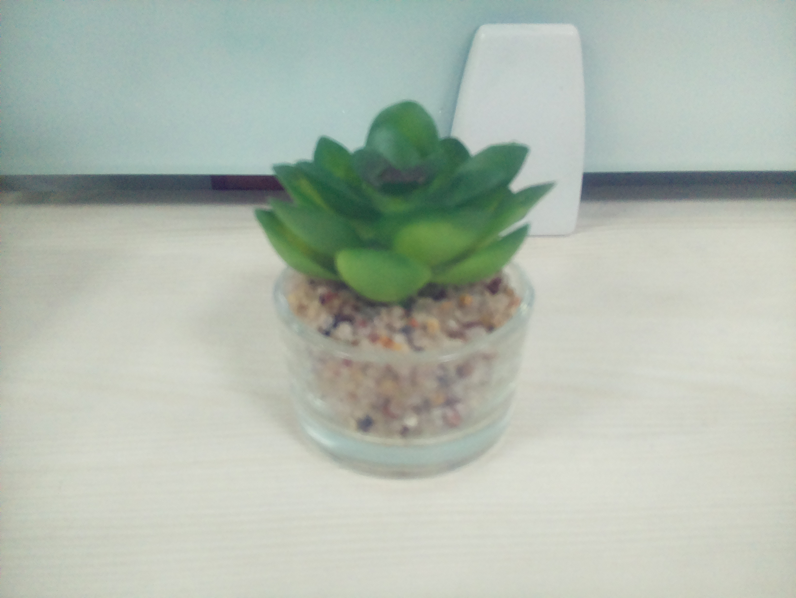
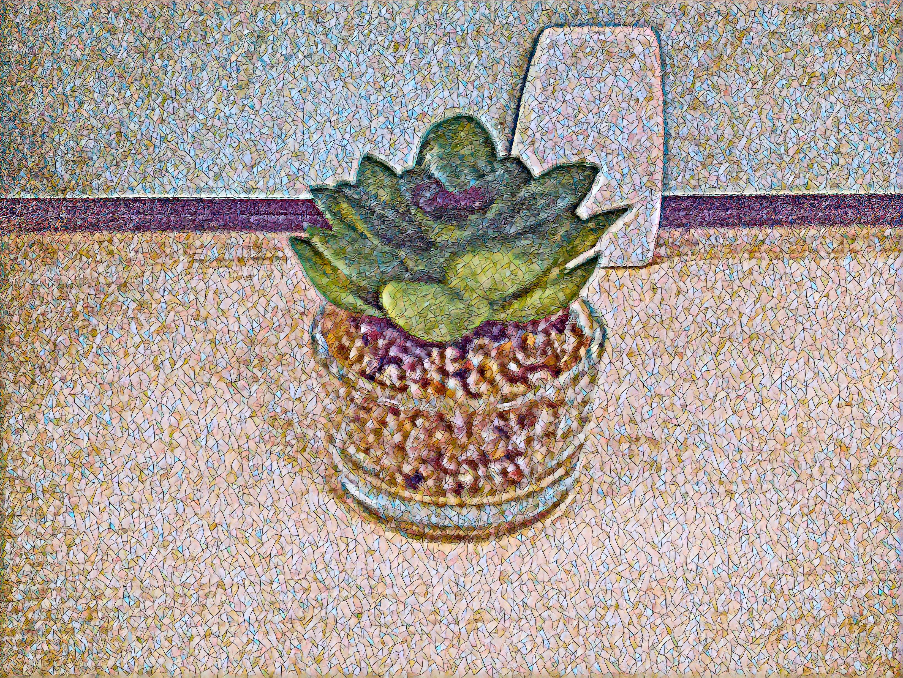
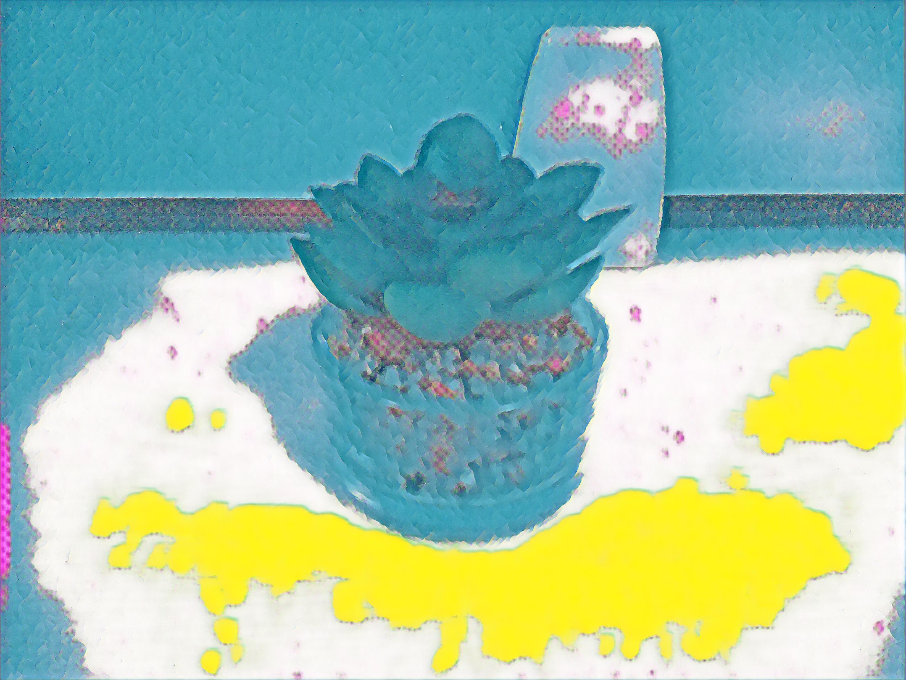
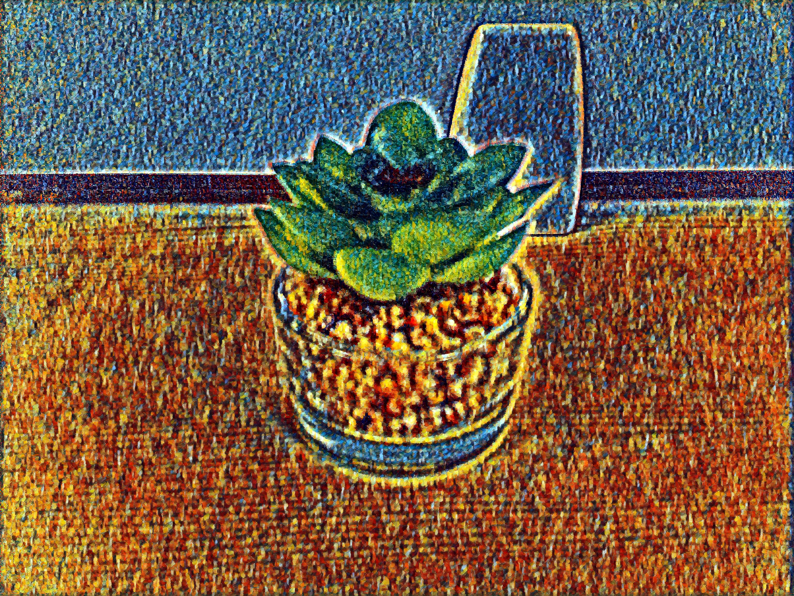

# 🎨 Neural Art Style Transfer on Raspberry Pi 4

An **edge AI application** that performs neural artistic style transfer using a  
**Raspberry Pi 4**, **IMX219 camera**, and **Waveshare 7-inch DSI LCD (C)**.

The system captures an image, applies a selected artistic style using  
**ONNX Runtime**, and displays the stylized output in fullscreen via a custom UI.

---

## 🚀 Features

- 📸 Live image capture using IMX219 camera  
- 🎨 Multiple neural art styles using ONNX models  
- ⚡ Optimized CPU inference with ONNX Runtime  
- 🖥️ Fullscreen Tkinter-based UI  
- 🔌 Direct DSI display (no HDMI required)  
- 🧠 Fully offline edge AI inference  

---

## 🛠️ Hardware Setup

- **Raspberry Pi 4**
- **IMX219 Camera Module**
- **Waveshare 7-inch DSI LCD (C)**

### ⚠️ Cooling Requirement (Important)

> **A heatsink (and preferably a small fan) is strongly recommended.**

Neural style transfer inference is CPU-intensive and can cause the Raspberry Pi 4  
to **overheat and throttle performance** during prolonged usage.

### 📷 Hardware Assembly


---

## 🧰 Software Stack

- Python 3.9+
- PyTorch (tensor utilities)
- ONNX Runtime (CPU inference)
- Tkinter (GUI)
- PIL & NumPy (image processing)
- rpicam-apps (camera capture using libcamera)

---
## 🖼️ Application Results

### 🏠 Home Screen UI


---

### 📸 Raw Captured Image


---

### 🎨 Mosaic Style Output


---

### 🎨 Pop Art Style Output


---

### 🎨 Rain Princess Style Output


## ⚙️ Raspberry Pi Configuration

After flashing **Raspberry Pi OS**, update the configuration file:

```bash
sudo nano /boot/config.txt
